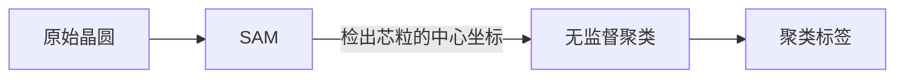

## 芯粒检测数据准备

### 智能标注流程图

### 输入输出格式

见 [算法依赖](http://jhkones.hisensecloud.com/wiki/#/team/7s9Np4qN/space/CXXKNS61/page/LdZZhB9m) 

### 环境安装

```shell
pip install -r requirements.txt
```

### 预训练模型
通过如下两个链接，下载预训练模型权重，放置于./checkpoints目录下
[CLIP下载](https://openaipublic.azureedge.net/clip/models/3035c92b350959924f9f00213499208652fc7ea050643e8b385c2dac08641f02/ViT-L-14-336px.pt)
[SAM下载](https://www.jianguoyun.com/p/Db9ZdLEQw7jLChiVndwFIAA)
