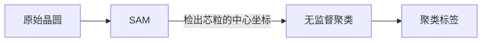

## 芯粒检测数据准备

### 智能标注流程图

```mermaid
flowchart LR
    A[原始晶圆] --> B[SAM]
    B --检出芯粒的中心坐标--> C[无监督聚类]
    C --> D[聚类标签]
```
### 输入输出格式

见[算法依赖](http://jhkones.hisensecloud.com/wiki/#/team/7s9Np4qN/space/CXXKNS61/page/LdZZhB9m) 

### 环境安装

```shell
pip install -r requirements.txt
```
